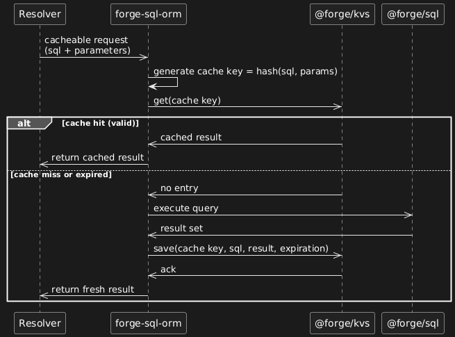
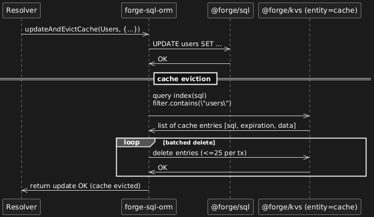
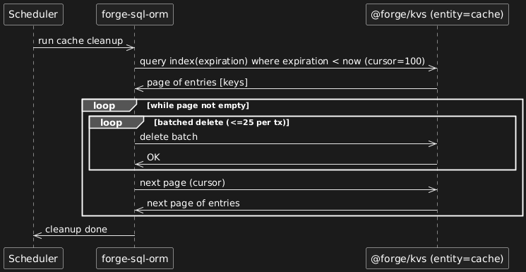
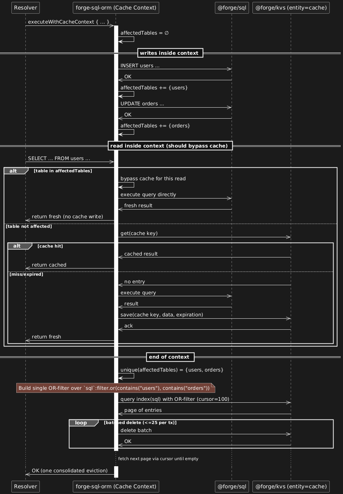

# Forge SQL ORM

[](https://www.npmjs.com/package/forge-sql-orm)
[](https://www.npmjs.com/package/forge-sql-orm)
[](https://www.npmjs.com/package/forge-sql-orm-cli)
[](https://www.npmjs.com/package/forge-sql-orm-cli)

[](https://github.com/vzakharchenko/forge-sql-orm/blob/master/LICENSE)

[](https://github.com/vzakharchenko/forge-sql-orm/actions/workflows/node.js.yml)
[](https://coveralls.io/github/vzakharchenko/forge-sql-orm?branch=master)
[](https://deepscan.io/dashboard#view=project&tid=26652&pid=29272&bid=940614)

**Forge-SQL-ORM** is an ORM designed for working with [@forge/sql](https://developer.atlassian.com/platform/forge/storage-reference/sql-tutorial/) in **Atlassian Forge**. It is built on top of [Drizzle ORM](https://orm.drizzle.team) and provides advanced capabilities for working with relational databases inside Forge.

## Key Features

- ✅ **Custom Drizzle Driver** for direct integration with @forge/sql
- ✅ **Local Cache System (Level 1)** for in-memory query optimization within single resolver invocation scope
- ✅ **Global Cache System (Level 2)** with cross-invocation caching, automatic cache invalidation and context-aware operations (using [@forge/kvs](https://developer.atlassian.com/platform/forge/storage-reference/storage-api-custom-entities/) )
- ✅ **Performance Monitoring**: Query execution metrics and analysis capabilities with automatic error analysis for timeout and OOM errors, plus scheduled slow query monitoring with execution plans
- ✅ **Type-Safe Query Building**: Write SQL queries with full TypeScript support
- ✅ **Supports complex SQL queries** with joins and filtering using Drizzle ORM
- ✅ **Advanced Query Methods**: `selectFrom()`, `selectDistinctFrom()`, `selectCacheableFrom()`, `selectDistinctCacheableFrom()` for all-column queries with field aliasing
- ✅ **Query Execution with Metadata**: `executeWithMetadata()` method for capturing detailed execution metrics including database execution time, response size, and query analysis capabilities with performance monitoring
- ✅ **Raw SQL Execution**: `execute()`, `executeCacheable()`, `executeDDL()`, and `executeDDLActions()` methods for direct SQL queries with local and global caching
- ✅ **Common Table Expressions (CTEs)**: `with()` method for complex queries with subqueries
- ✅ **Schema migration support**, allowing automatic schema evolution
- ✅ **Automatic entity generation** from MySQL/tidb databases
- ✅ **Automatic migration generation** from MySQL/tidb databases
- ✅ **Drop Migrations** Generate a migration to drop all tables and clear migrations history for subsequent schema recreation
- ✅ **Schema Fetching** Development-only web trigger to retrieve current database schema and generate SQL statements for schema recreation
- ✅ **Ready-to-use Migration Triggers** Built-in web triggers for applying migrations, dropping tables (development-only), and fetching schema (development-only) with proper error handling and security controls
- ✅ **Optimistic Locking** Ensures data consistency by preventing conflicts when multiple users update the same record
- ✅ **Query Plan Analysis**: Detailed execution plan analysis and optimization insights

## Table of Contents

### 🚀 Getting Started

- [Key Features](#key-features)
- [Usage Approaches](#usage-approaches)
- [Installation](#installation)
- [CLI Commands](#cli-commands) | [CLI Documentation](forge-sql-orm-cli/README.md)
- [Quick Start](#quick-start)

### 📖 Core Features

- [Field Name Collision Prevention](#field-name-collision-prevention-in-complex-queries)
- [Drizzle Usage with forge-sql-orm](#drizzle-usage-with-forge-sql-orm)
- [Direct Drizzle Usage with Custom Driver](#direct-drizzle-usage-with-custom-driver)

### 🗄️ Database Operations

- [Fetch Data](#fetch-data)
- [Modify Operations](#modify-operations)
- [SQL Utilities](#sql-utilities)

### ⚡ Caching System

- [Setting Up Caching with @forge/kvs](#setting-up-caching-with-forgekvs-optional)
- [Global Cache System (Level 2)](#global-cache-system-level-2)
- [Cache Context Operations](#cache-context-operations)
- [Local Cache Operations (Level 1)](#local-cache-operations-level-1)
- [Cache-Aware Query Operations](#cache-aware-query-operations)
- [Manual Cache Management](#manual-cache-management)

### 🔒 Advanced Features

- [Optimistic Locking](#optimistic-locking)
- [Query Analysis and Performance Optimization](#query-analysis-and-performance-optimization)
- [Automatic Error Analysis](#automatic-error-analysis) - Automatic timeout and OOM error detection with execution plans
- [Slow Query Monitoring](#slow-query-monitoring) - Scheduled monitoring of slow queries with execution plans
- [Date and Time Types](#date-and-time-types)

### 🛠️ Development Tools

- [CLI Commands](#cli-commands) | [CLI Documentation](forge-sql-orm-cli/README.md)
- [Web Triggers for Migrations](#web-triggers-for-migrations)
- [Step-by-Step Migration Workflow](#step-by-step-migration-workflow)
- [Drop Migrations](#drop-migrations)

### 📚 Examples

- [Simple Example](examples/forge-sql-orm-example-simple)
- [Drizzle Driver Example](examples/forge-sql-orm-example-drizzle-driver-simple)
- [Optimistic Locking Example](examples/forge-sql-orm-example-optimistic-locking)
- [Dynamic Queries Example](examples/forge-sql-orm-example-dynamic)
- [Query Analysis Example](examples/forge-sql-orm-example-query-analyses)
- [Organization Tracker Example](examples/forge-sql-orm-example-org-tracker)
- [Checklist Example](examples/forge-sql-orm-example-checklist)
- [Cache Example](examples/forge-sql-orm-example-cache) - Advanced caching capabilities with performance monitoring

### 📚 Reference

- [ForgeSqlOrmOptions](#forgesqlormoptions)
- [Migration Guide](#migration-guide)

## 🚀 Quick Navigation

**New to Forge-SQL-ORM?** Start here:

- [Quick Start](#quick-start) - Get up and running in 5 minutes
- [Installation](#installation) - Complete setup guide
- [Basic Usage Examples](#fetch-data) - Simple query examples

**Looking for specific features?**

- [Global Cache System (Level 2)](#global-cache-system-level-2) - Cross-invocation persistent caching
- [Local Cache System (Level 1)](#local-cache-operations-level-1) - In-memory invocation caching
- [Optimistic Locking](#optimistic-locking) - Data consistency
- [Migration Tools](#web-triggers-for-migrations) - Database migrations
- [Query Analysis](#query-analysis-and-performance-optimization) - Performance optimization

**Looking for practical examples?**

- [Simple Example](examples/forge-sql-orm-example-simple) - Basic ORM usage
- [Optimistic Locking Example](examples/forge-sql-orm-example-optimistic-locking) - Real-world conflict handling
- [Organization Tracker Example](examples/forge-sql-orm-example-org-tracker) - Complex relationships
- [Checklist Example](examples/forge-sql-orm-example-checklist) - Jira integration
- [Cache Example](examples/forge-sql-orm-example-cache) - Advanced caching capabilities

## Usage Approaches

### 1. Full Forge-SQL-ORM Usage

```typescript
import ForgeSQL from "forge-sql-orm";
const forgeSQL = new ForgeSQL();
```

Best for: Advanced features like optimistic locking, automatic versioning, and automatic field name collision prevention in complex queries.

### 2. Direct Drizzle Usage

```typescript
import { drizzle } from "drizzle-orm/mysql-proxy";
import { forgeDriver } from "forge-sql-orm";
const db = drizzle(forgeDriver);
```

Best for: Simple Modify operations without optimistic locking. Note that you need to manually patch drizzle `patchDbWithSelectAliased` for select fields to prevent field name collisions in Atlassian Forge SQL.

### 3. Local Cache Optimization

```typescript
import ForgeSQL from "forge-sql-orm";
const forgeSQL = new ForgeSQL();

// Optimize repeated queries within a single invocation
await forgeSQL.executeWithLocalContext(async () => {
  // Multiple queries here will benefit from local caching
  const users = await forgeSQL
    .select({ id: users.id, name: users.name })
    .from(users)
    .where(eq(users.active, true));

  // This query will use local cache (no database call)
  const cachedUsers = await forgeSQL
    .select({ id: users.id, name: users.name })
    .from(users)
    .where(eq(users.active, true));

  // Using new methods for better performance
  const usersFrom = await forgeSQL.selectFrom(users).where(eq(users.active, true));

  // This will use local cache (no database call)
  const cachedUsersFrom = await forgeSQL.selectFrom(users).where(eq(users.active, true));

  // Raw SQL with local caching
  const rawUsers = await forgeSQL.execute("SELECT id, name FROM users WHERE active = ?", [true]);
});
```

Best for: Performance optimization of repeated queries within resolvers or single invocation contexts.

## Field Name Collision Prevention in Complex Queries

When working with complex queries involving multiple tables (joins, inner joins, etc.), Atlassian Forge SQL has a specific behavior where fields with the same name from different tables get collapsed into a single field with a null value. This is not a Drizzle ORM issue but rather a characteristic of Atlassian Forge SQL's behavior.

Forge-SQL-ORM provides two ways to handle this:

### Using Forge-SQL-ORM

```typescript
import ForgeSQL from "forge-sql-orm";

const forgeSQL = new ForgeSQL();

// Automatic field name collision prevention
await forgeSQL
  .select({ user: users, order: orders })
  .from(orders)
  .innerJoin(users, eq(orders.userId, users.id));
```

### Using Direct Drizzle

```typescript
import { drizzle } from "drizzle-orm/mysql-proxy";
import { forgeDriver, patchDbWithSelectAliased } from "forge-sql-orm";

const db = patchDbWithSelectAliased(drizzle(forgeDriver));

// Manual field name collision prevention
await db
  .selectAliased({ user: users, order: orders })
  .from(orders)
  .innerJoin(users, eq(orders.userId, users.id));
```

### Important Notes

- This is a specific behavior of Atlassian Forge SQL, not Drizzle ORM
- For complex queries involving multiple tables, it's recommended to always specify select fields and avoid using `select()` without field selection
- The solution automatically creates unique aliases for each field by prefixing them with the table name
- This ensures that fields with the same name from different tables remain distinct in the query results

## Installation

Forge-SQL-ORM is designed to work with @forge/sql and requires some additional setup to ensure compatibility within Atlassian Forge.

✅ Step 1: Install Dependencies

**Basic installation (without caching):**

```sh
npm install forge-sql-orm @forge/sql drizzle-orm -S
```

**With caching support:**

```sh
npm install forge-sql-orm @forge/sql @forge/kvs drizzle-orm -S
```

**⚠️ Important for UI-Kit projects:**

If you're installing `forge-sql-orm` in a UI-Kit project (projects using `@forge/react`), you may encounter peer dependency conflicts with `@types/react`. This is due to a conflict between `@types/react@18` (required by `@forge/react`) and `@types/react@19` (optional peer dependency from `drizzle-orm` via `bun-types`).

To resolve this, use the `--legacy-peer-deps` flag:

```sh
# Basic installation for UI-Kit projects
npm install forge-sql-orm @forge/sql drizzle-orm -S --legacy-peer-deps

# With caching support for UI-Kit projects
npm install forge-sql-orm @forge/sql @forge/kvs drizzle-orm -S --legacy-peer-deps
```

**Note:** The `--legacy-peer-deps` flag tells npm to ignore peer dependency conflicts. This is safe in this case because `bun-types` is an optional peer dependency and doesn't affect the functionality of `forge-sql-orm` in Forge environments.

This will:

- Install Forge-SQL-ORM (the ORM for @forge/sql)
- Install @forge/sql, the Forge database layer
- Install @forge/kvs, the Forge Key-Value Store for caching (optional, only needed for caching features)
- Install Drizzle ORM and its MySQL driver
- Install TypeScript types for MySQL
- Install forge-sql-orm-cli A command-line interface tool for managing Atlassian Forge SQL migrations and model generation with Drizzle ORM integration.

## Quick Start

### 1. Basic Setup

```typescript
import ForgeSQL from "forge-sql-orm";

// Initialize ForgeSQL
const forgeSQL = new ForgeSQL();

// Simple query
const users = await forgeSQL.select().from(users);
```

### 2. With Caching (Optional)

```typescript
import ForgeSQL from "forge-sql-orm";

// Initialize with caching
const forgeSQL = new ForgeSQL({
  cacheEntityName: "cache",
  cacheTTL: 300,
});

// Cached query
const users = await forgeSQL
  .selectCacheable({ id: users.id, name: users.name })
  .from(users)
  .where(eq(users.active, true));
```

### 3. Local Cache Optimization

```typescript
// Optimize repeated queries within a single invocation
await forgeSQL.executeWithLocalContext(async () => {
  const users = await forgeSQL
    .select({ id: users.id, name: users.name })
    .from(users)
    .where(eq(users.active, true));

  // This query will use local cache (no database call)
  const cachedUsers = await forgeSQL
    .select({ id: users.id, name: users.name })
    .from(users)
    .where(eq(users.active, true));

  // Using new methods for better performance
  const usersFrom = await forgeSQL.selectFrom(users).where(eq(users.active, true));

  // Raw SQL with local caching
  const rawUsers = await forgeSQL.execute("SELECT id, name FROM users WHERE active = ?", [true]);
});
```

### 4. Resolver Performance Monitoring

```typescript
// Resolver with performance monitoring
resolver.define("fetch", async (req: Request) => {
  try {
    return await forgeSQL.executeWithMetadata(
      async () => {
        // Resolver logic with multiple queries
        const users = await forgeSQL.selectFrom(demoUsers);
        const orders = await forgeSQL
          .selectFrom(demoOrders)
          .where(eq(demoOrders.userId, demoUsers.id));
        return { users, orders };
      },
      async (totalDbExecutionTime, totalResponseSize, printQueriesWithPlan) => {
        const threshold = 500; // ms baseline for this resolver

        if (totalDbExecutionTime > threshold * 1.5) {
          console.warn(
            `[Performance Warning fetch] Resolver exceeded DB time: ${totalDbExecutionTime} ms`,
          );
          await printQueriesWithPlan(); // Optionally log or capture diagnostics for further analysis
        } else if (totalDbExecutionTime > threshold) {
          console.debug(`[Performance Debug fetch] High DB time: ${totalDbExecutionTime} ms`);
        }
      },
    );
  } catch (e) {
    const error = e?.cause?.debug?.sqlMessage ?? e?.cause;
    console.error(error, e);
    throw error;
  }
});
```

### 5. Next Steps

- [Full Installation Guide](#installation) - Complete setup instructions
- [Core Features](#core-features) - Learn about key capabilities
- [Global Cache System (Level 2)](#global-cache-system-level-2) - Cross-invocation caching features
- [Local Cache System (Level 1)](#local-cache-operations-level-1) - In-memory caching features
- [API Reference](#reference) - Complete API documentation

## Drizzle Usage with forge-sql-orm

If you prefer to use Drizzle ORM with the additional features of Forge-SQL-ORM (like optimistic locking and caching), you can use the enhanced API:

```typescript
import ForgeSQL from "forge-sql-orm";
const forgeSQL = new ForgeSQL();

// Versioned operations with cache management (recommended)
await forgeSQL.modifyWithVersioningAndEvictCache().insert(Users, [userData]);
await forgeSQL.modifyWithVersioningAndEvictCache().updateById(updateData, Users);

// Versioned operations without cache management
await forgeSQL.modifyWithVersioning().insert(Users, [userData]);
await forgeSQL.modifyWithVersioning().updateById(updateData, Users);

// Non-versioned operations with cache management
await forgeSQL.insertAndEvictCache(Users).values(userData);
await forgeSQL.updateAndEvictCache(Users).set(updateData).where(eq(Users.id, 1));

// Basic Drizzle operations (cache context aware)
await forgeSQL.insert(Users).values(userData);
await forgeSQL.update(Users).set(updateData).where(eq(Users.id, 1));

// Direct Drizzle access
const db = forgeSQL.getDrizzleQueryBuilder();
const users = await db.select().from(users);

// Using new methods for enhanced functionality
const usersFrom = await forgeSQL.selectFrom(users).where(eq(users.active, true));

const usersDistinct = await forgeSQL.selectDistinctFrom(users).where(eq(users.active, true));

const usersCacheable = await forgeSQL.selectCacheableFrom(users).where(eq(users.active, true));

// Raw SQL execution
const rawUsers = await forgeSQL.execute("SELECT * FROM users WHERE active = ?", [true]);

// Raw SQL with caching
// ⚠️ IMPORTANT: When using executeCacheable(), all table names must be wrapped with backticks (`)
const cachedRawUsers = await forgeSQL.executeCacheable(
  "SELECT * FROM `users` WHERE active = ?",
  [true],
  300,
);

// Raw SQL with execution metadata and performance monitoring
const usersWithMetadata = await forgeSQL.executeWithMetadata(
  async () => {
    const users = await forgeSQL.selectFrom(usersTable);
    const orders = await forgeSQL
      .selectFrom(ordersTable)
      .where(eq(ordersTable.userId, usersTable.id));
    return { users, orders };
  },
  (totalDbExecutionTime, totalResponseSize, printQueriesWithPlan) => {
    const threshold = 500; // ms baseline for this resolver

    if (totalDbExecutionTime > threshold * 1.5) {
      console.warn(`[Performance Warning] Resolver exceeded DB time: ${totalDbExecutionTime} ms`);
      await printQueriesWithPlan(); // Analyze and print query execution plans
    } else if (totalDbExecutionTime > threshold) {
      console.debug(`[Performance Debug] High DB time: ${totalDbExecutionTime} ms`);
    }

    console.log(`DB response size: ${totalResponseSize} bytes`);
  },
);

// DDL operations for schema modifications
await forgeSQL.executeDDL(`
  CREATE TABLE users (
    id INT PRIMARY KEY AUTO_INCREMENT,
    name VARCHAR(255) NOT NULL,
    email VARCHAR(255) UNIQUE
  )
`);

// Execute regular SQL queries in DDL context for performance monitoring
await forgeSQL.executeDDLActions(async () => {
  // Execute regular SQL queries in DDL context for monitoring
  const slowQueries = await forgeSQL.execute(`
    SELECT * FROM INFORMATION_SCHEMA.STATEMENTS_SUMMARY 
    WHERE AVG_LATENCY > 1000000
  `);

  // Execute complex analysis queries in DDL context
  const performanceData = await forgeSQL.execute(`
    SELECT * FROM INFORMATION_SCHEMA.CLUSTER_STATEMENTS_SUMMARY_HISTORY
    WHERE SUMMARY_END_TIME > DATE_SUB(NOW(), INTERVAL 1 HOUR)
  `);

  return { slowQueries, performanceData };
});

// Common Table Expressions (CTEs)
const userStats = await forgeSQL
  .with(
    forgeSQL.selectFrom(users).where(eq(users.active, true)).as("activeUsers"),
    forgeSQL.selectFrom(orders).where(eq(orders.status, "completed")).as("completedOrders"),
  )
  .select({
    totalActiveUsers: sql`COUNT(au.id)`,
    totalCompletedOrders: sql`COUNT(co.id)`,
  })
  .from(sql`activeUsers au`)
  .leftJoin(sql`completedOrders co`, eq(sql`au.id`, sql`co.userId`));
```

This approach gives you direct access to all Drizzle ORM features while still using the @forge/sql backend with enhanced caching and versioning capabilities.

## Direct Drizzle Usage with Custom Driver

If you prefer to use Drizzle ORM directly without the additional features of Forge-SQL-ORM (like optimistic locking), you can use the custom driver:

```typescript
import { drizzle } from "drizzle-orm/mysql-proxy";
import { forgeDriver, patchDbWithSelectAliased } from "forge-sql-orm";

// Initialize drizzle with the custom driver and patch it for aliased selects
const db = patchDbWithSelectAliased(drizzle(forgeDriver));

// Use drizzle directly
const users = await db.select().from(users);
const users = await db.selectAliased(getTableColumns(users)).from(users);
const users = await db.selectAliasedDistinct(getTableColumns(users)).from(users);
await db.insert(users)...;
await db.update(users)...;
await db.delete(users)...;
// Use drizzle with kvs cache
const users = await db.selectAliasedCacheable(getTableColumns(users)).from(users);
const users = await db.selectAliasedDistinctCacheable(getTableColumns(users)).from(users);
await db.insertAndEvictCache(users)...;
await db.updateAndEvictCache(users)...;
await db.deleteAndEvictCache(users)...;

// Use drizzle with kvs cache context
await forgeSQL.executeWithCacheContext(async () => {
  await db.insertWithCacheContext(users)...;
  await db.updateWithCacheContext(users)...;
  await db.deleteWithCacheContext(users)...;
  // invoke without cache
   const users = await db.selectAliasedCacheable(getTableColumns(users)).from(users);
  // Cache is cleared only once at the end for all affected tables
});

// Using new methods with direct drizzle
const usersFrom = await forgeSQL.selectFrom(users)
  .where(eq(users.active, true));

const usersDistinct = await forgeSQL.selectDistinctFrom(users)
  .where(eq(users.active, true));

const usersCacheable = await forgeSQL.selectCacheableFrom(users)
  .where(eq(users.active, true));

// Raw SQL execution
const rawUsers = await forgeSQL.execute(
  "SELECT * FROM users WHERE active = ?",
  [true]
);

// Raw SQL with caching
// ⚠️ IMPORTANT: When using executeCacheable(), all table names must be wrapped with backticks (`)
const cachedRawUsers = await forgeSQL.executeCacheable(
  "SELECT * FROM `users` WHERE active = ?",
  [true],
  300
);

// Raw SQL with execution metadata and performance monitoring
const usersWithMetadata = await forgeSQL.executeWithMetadata(
  async () => {
    const users = await forgeSQL.selectFrom(usersTable);
    const orders = await forgeSQL.selectFrom(ordersTable).where(eq(ordersTable.userId, usersTable.id));
    return { users, orders };
  },
  (totalDbExecutionTime, totalResponseSize, printQueriesWithPlan) => {
    const threshold = 500; // ms baseline for this resolver

    if (totalDbExecutionTime > threshold * 1.5) {
      console.warn(`[Performance Warning] Resolver exceeded DB time: ${totalDbExecutionTime} ms`);
      await printQueriesWithPlan(); // Analyze and print query execution plans
    } else if (totalDbExecutionTime > threshold) {
      console.debug(`[Performance Debug] High DB time: ${totalDbExecutionTime} ms`);
    }

    console.log(`DB response size: ${totalResponseSize} bytes`);
  }
);
```

## Setting Up Caching with @forge/kvs (Optional)

The caching system is optional and only needed if you want to use cache-related features. To enable the caching system, you need to install the required dependency and configure your manifest.

### How Caching Works

To use caching, you need to use Forge-SQL-ORM methods that support cache management:

**Methods that perform cache eviction after execution and in cache context (batch eviction):**

- `forgeSQL.insertAndEvictCache()`
- `forgeSQL.updateAndEvictCache()`
- `forgeSQL.deleteAndEvictCache()`
- `forgeSQL.modifyWithVersioningAndEvictCache()`
- `forgeSQL.getDrizzleQueryBuilder().insertAndEvictCache()`
- `forgeSQL.getDrizzleQueryBuilder().updateAndEvictCache()`
- `forgeSQL.getDrizzleQueryBuilder().deleteAndEvictCache()`

**Methods that participate in cache context only (batch eviction):**

- All methods except the default Drizzle methods:
  - `forgeSQL.insert()`
  - `forgeSQL.update()`
  - `forgeSQL.delete()`
  - `forgeSQL.modifyWithVersioning()`
  - `forgeSQL.getDrizzleQueryBuilder().insertWithCacheContext()`
  - `forgeSQL.getDrizzleQueryBuilder().updateWithCacheContext()`
  - `forgeSQL.getDrizzleQueryBuilder().deleteWithCacheContext()`

**Methods do not do evict cache, better do not use with cache feature:**

- `forgeSQL.getDrizzleQueryBuilder().insert()`
- `forgeSQL.getDrizzleQueryBuilder().update()`
- `forgeSQL.getDrizzleQueryBuilder().delete()`

**Cacheable methods:**

- `forgeSQL.selectCacheable()`
- `forgeSQL.selectDistinctCacheable()`
- `forgeSQL.getDrizzleQueryBuilder().selectAliasedCacheable()`
- `forgeSQL.getDrizzleQueryBuilder().selectAliasedDistinctCacheable()`

**Cache context example:**

```typescript
await forgeSQL.executeWithCacheContext(async () => {
  // These methods participate in batch cache clearing
  await forgeSQL.insert(Users).values(userData);
  await forgeSQL.update(Users).set(updateData).where(eq(Users.id, 1));
  await forgeSQL.delete(Users).where(eq(Users.id, 1));
  // Cache is cleared only once at the end for all affected tables
});
```

The diagram below shows the lifecycle of a cacheable query in Forge-SQL-ORM:

1. Resolver calls forge-sql-orm with a SQL query and parameters.
2. forge-sql-orm generates a cache key = hash(sql, parameters).
3. It asks @forge/kvs for an existing cached result.
   - Cache hit → result is returned immediately.
   - Cache miss / expired → query is executed against @forge/sql.
4. Fresh result is stored in @forge/kvs with TTL and returned to the caller.



The diagram below shows how Evict Cache works in Forge-SQL-ORM:

1. **Data modification** is executed through `@forge/sql` (e.g., `UPDATE users ...`).
2. After a successful update, **forge-sql-orm** queries the `cache` entity by using the **`sql` field** with `filter.contains("users")` to find affected cached queries.
3. The returned cache entries are deleted in **batches** (up to 25 per transaction).
4. Once eviction is complete, the update result is returned to the resolver.
5. **Note:** Expired entries are not processed here — they are cleaned up separately by the scheduled cache cleanup trigger using the `expiration` index.



The diagram below shows how Scheduled Expiration Cleanup works:

1. A periodic scheduler (Forge trigger) runs cache cleanup independently of data modifications.
2. forge-sql-orm queries the cache entity by the expiration index to find entries with expiration < now.
3. Entries are deleted in batches (up to 25 per transaction) until the page is empty; pagination is done with a cursor (e.g., 100 per page).
4. This keeps the cache footprint small and prevents stale data accumulation.



The diagram below shows how Cache Context works:

`executeWithCacheContext(fn)` lets you group multiple data modifications and perform **one consolidated cache eviction** at the end:

1. The context starts with an empty `affectedTables` set.
2. Each successful `INSERT/UPDATE/DELETE` inside the context registers its table name in `affectedTables`.
3. **Reads inside the same context** that target tables present in `affectedTables` will **bypass the cache** (read-through to SQL) to avoid serving stale data. These reads also **do not write** back to cache until eviction completes.
4. On context completion, `affectedTables` is de-duplicated and used to build **one combined KVS query** over the `sql` field with
   `filter.or(filter.contains("<t1>"), filter.contains("<t2>"), ...)`, returning all impacted cache entries in a single scan (paged by cursor, e.g., 100/page).
5. Matching cache entries are deleted in **batches** (≤25 per transaction) until the page is exhausted; then the next page is fetched via the cursor.
6. Expiration is handled separately by the scheduled cleanup and is **not part of** the context flow.



### Important Considerations

**@forge/kvs Limits:**
Please review the [official @forge/kvs quotas and limits](https://developer.atlassian.com/platform/forge/platform-quotas-and-limits/#kvs-and-custom-entity-store-quotas) before implementing caching.

**Caching Guidelines:**

- Don't cache everything - be selective about what to cache
- Don't cache simple and fast queries - sometimes direct query is faster than cache
- Consider data size and frequency of changes
- Monitor cache usage to stay within quotas
- Use appropriate TTL values

**⚠️ Important Cache Limitations:**

- **Table names starting with `a_`**: Tables whose names start with `a_` (case-insensitive) are automatically ignored in cache operations. KVS Cache will not work with such tables, and they will be excluded from cache invalidation and cache key generation.

### Step 1: Install Dependencies

```bash
npm install @forge/kvs -S
```

### Step 2: Configure Manifest

Add the storage entity configuration and scheduler trigger to your `manifest.yml`:

```yaml
modules:
  scheduledTrigger:
    - key: clear-cache-trigger
      function: clearCache
      interval: fiveMinute
  storage:
    entities:
      - name: cache
        attributes:
          sql:
            type: string
          expiration:
            type: integer
          data:
            type: string
        indexes:
          - sql
          - expiration
  sql:
    - key: main
      engine: mysql
  function:
    - key: clearCache
      handler: index.clearCache
```

```typescript
// Example usage in your Forge app
import { clearCacheSchedulerTrigger } from "forge-sql-orm";

export const clearCache = () => {
  return clearCacheSchedulerTrigger({
    cacheEntityName: "cache",
  });
};
```

### Step 3: Configure ORM Options

Set the cache entity name in your ForgeSQL configuration:

```typescript
const options = {
  cacheEntityName: "cache", // Must match the entity name in manifest.yml
  cacheTTL: 300, // Default cache TTL in seconds (5 minutes)
  cacheWrapTable: true, // Wrap table names with backticks in cache keys
  // ... other options
};

const forgeSQL = new ForgeSQL(options);
```

**Important Notes:**

- The `cacheEntityName` must exactly match the `name` in your manifest storage entities
- The entity attributes (`sql`, `expiration`, `data`) are required for proper cache functionality
- Indexes on `sql` and `expiration` improve cache lookup performance
- Cache data is automatically cleaned up based on TTL settings
- No additional permissions are required beyond standard Forge app permissions

### Complete Setup Examples

**Basic setup (without caching):**

**package.json:**

```shell
npm install forge-sql-orm @forge/sql drizzle-orm -S
# For UI-Kit projects, use: npm install forge-sql-orm @forge/sql drizzle-orm -S --legacy-peer-deps
```

**manifest.yml:**

```yaml
modules:
  sql:
    - key: main
      engine: mysql
```

**index.ts:**

```typescript
import ForgeSQL from "forge-sql-orm";

const forgeSQL = new ForgeSQL();

// simple insert
await forgeSQL.insert(Users, [userData]);
// Use versioned operations without caching
await forgeSQL.modifyWithVersioning().insert(Users, [userData]);
const users = await forgeSQL.select({ id: Users.id });
```

**With caching support:**

```shell
npm install forge-sql-orm @forge/sql @forge/kvs drizzle-orm -S
# For UI-Kit projects, use: npm install forge-sql-orm @forge/sql @forge/kvs drizzle-orm -S --legacy-peer-deps
```

**manifest.yml:**

```yaml
modules:
  scheduledTrigger:
    - key: clear-cache-trigger
      function: clearCache
      interval: fiveMinute
  storage:
    entities:
      - name: cache
        attributes:
          sql:
            type: string
          expiration:
            type: integer
          data:
            type: string
        indexes:
          - sql
          - expiration
  sql:
    - key: main
      engine: mysql
  function:
    - key: clearCache
      handler: index.clearCache
```

**index.ts:**

```typescript
import ForgeSQL from "forge-sql-orm";

const forgeSQL = new ForgeSQL({
  cacheEntityName: "cache",
});

import { clearCacheSchedulerTrigger } from "forge-sql-orm";
import { getTableColumns } from "drizzle-orm";

export const clearCache = () => {
  return clearCacheSchedulerTrigger({
    cacheEntityName: "cache",
  });
};

// Now you can use caching features
const usersData = await forgeSQL
  .selectCacheable(getTableColumns(users))
  .from(users)
  .where(eq(users.active, true));

// simple insert
await forgeSQL.insertAndEvictCache(users, [userData]);
// Use versioned operations with caching
await forgeSQL.modifyWithVersioningAndEvictCache().insert(users, [userData]);

// use Cache Context
const data = await forgeSQL.executeWithCacheContextAndReturnValue(async () => {
  // after insert mark users to evict
  await forgeSQL.insert(users, [userData]);
  // after insertAndEvictCache mark orders to evict
  await forgeSQL.insertAndEvictCache(orders, [order1, order2]);
  // execute query and put result to local cache
  await forgeSQL
    .selectCacheable({
      userId: users.id,
      userName: users.name,
      orderId: orders.id,
      orderName: orders.name,
    })
    .from(users)
    .innerJoin(orders, eq(orders.userId, users.id))
    .where(eq(users.active, true));
  // use local cache without @forge/kvs and @forge/sql
  return await forgeSQL
    .selectCacheable({
      userId: users.id,
      userName: users.name,
      orderId: orders.id,
      orderName: orders.name,
    })
    .from(users)
    .innerJoin(orders, eq(orders.userId, users.id))
    .where(eq(users.active, true));
});
// execute query and put result to kvs cache
await forgeSQL
  .selectCacheable({
    userId: users.id,
    userName: users.name,
    orderId: orders.id,
    orderName: orders.name,
  })
  .from(users)
  .innerJoin(orders, eq(orders.userId, users.id))
  .where(eq(users.active, true));

// get result from @foge/kvs cache without real @forge/sql call
await forgeSQL
  .selectCacheable({
    userId: users.id,
    userName: users.name,
    orderId: orders.id,
    orderName: orders.name,
  })
  .from(users)
  .innerJoin(orders, eq(orders.userId, users.id))
  .where(eq(users.active, true));

// use Local Cache for performance optimization
const optimizedData = await forgeSQL.executeWithLocalCacheContextAndReturnValue(async () => {
  // First query - hits database and caches result
  const users = await forgeSQL
    .select({ id: users.id, name: users.name })
    .from(users)
    .where(eq(users.active, true));

  // Second query - uses local cache (no database call)
  const cachedUsers = await forgeSQL
    .select({ id: users.id, name: users.name })
    .from(users)
    .where(eq(users.active, true));

  // Using new methods for better performance
  const usersFrom = await forgeSQL.selectFrom(users).where(eq(users.active, true));

  // This will use local cache (no database call)
  const cachedUsersFrom = await forgeSQL.selectFrom(users).where(eq(users.active, true));

  // Raw SQL with local caching
  const rawUsers = await forgeSQL.execute("SELECT id, name FROM users WHERE active = ?", [true]);

  // Insert operation - evicts local cache
  await forgeSQL.insert(users).values({ name: "New User", active: true });

  // Third query - hits database again and caches new result
  const updatedUsers = await forgeSQL
    .select({ id: users.id, name: users.name })
    .from(users)
    .where(eq(users.active, true));

  return { users, cachedUsers, updatedUsers, usersFrom, cachedUsersFrom, rawUsers };
});
```

## Choosing the Right Method - ForgeSQL ORM

### When to Use Each Approach

| Method                                | Use Case                                                    | Versioning | Cache Management     |
| ------------------------------------- | ----------------------------------------------------------- | ---------- | -------------------- |
| `modifyWithVersioningAndEvictCache()` | High-concurrency scenarios with Cache support               | ✅ Yes     | ✅ Yes               |
| `modifyWithVersioning()`              | High-concurrency scenarios                                  | ✅ Yes     | Cache Context        |
| `insertAndEvictCache()`               | Simple inserts                                              | ❌ No      | ✅ Yes               |
| `updateAndEvictCache()`               | Simple updates                                              | ❌ No      | ✅ Yes               |
| `deleteAndEvictCache()`               | Simple deletes                                              | ❌ No      | ✅ Yes               |
| `insert/update/delete`                | Basic Drizzle operations                                    | ❌ No      | Cache Context        |
| `selectFrom()`                        | All-column queries with field aliasing                      | ❌ No      | Local Cache          |
| `selectDistinctFrom()`                | Distinct all-column queries with field aliasing             | ❌ No      | Local Cache          |
| `selectCacheableFrom()`               | All-column queries with field aliasing and caching          | ❌ No      | Local + Global Cache |
| `selectDistinctCacheableFrom()`       | Distinct all-column queries with field aliasing and caching | ❌ No      | Local + Global Cache |
| `execute()`                           | Raw SQL queries with local caching                          | ❌ No      | Local Cache          |
| `executeCacheable()`                  | Raw SQL queries with local and global caching               | ❌ No      | Local + Global Cache |
| `executeDDL()`                        | DDL operations (CREATE, ALTER, DROP, etc.)                  | ❌ No      | No Caching           |
| `executeDDLActions()`                 | Execute regular SQL queries in DDL operation context        | ❌ No      | No Caching           |
| `with()`                              | Common Table Expressions (CTEs)                             | ❌ No      | Local Cache          |

## Choosing the Right Method - Direct Drizzle

### When to Use Each Approach

| Method                                                                 | Use Case                                                    | Versioning | Cache Management     |
| ---------------------------------------------------------------------- | ----------------------------------------------------------- | ---------- | -------------------- |
| `insertWithCacheContext/insertWithCacheContext/updateWithCacheContext` | Basic Drizzle operations                                    | ❌ No      | Cache Context        |
| `insertAndEvictCache()`                                                | Simple inserts without conflicts                            | ❌ No      | ✅ Yes               |
| `updateAndEvictCache()`                                                | Simple updates without conflicts                            | ❌ No      | ✅ Yes               |
| `deleteAndEvictCache()`                                                | Simple deletes without conflicts                            | ❌ No      | ✅ Yes               |
| `insert/update/delete`                                                 | Basic Drizzle operations                                    | ❌ No      | ❌ No                |
| `selectFrom()`                                                         | All-column queries with field aliasing                      | ❌ No      | Local Cache          |
| `selectDistinctFrom()`                                                 | Distinct all-column queries with field aliasing             | ❌ No      | Local Cache          |
| `selectCacheableFrom()`                                                | All-column queries with field aliasing and caching          | ❌ No      | Local + Global Cache |
| `selectDistinctCacheableFrom()`                                        | Distinct all-column queries with field aliasing and caching | ❌ No      | Local + Global Cache |
| `execute()`                                                            | Raw SQL queries with local caching                          | ❌ No      | Local Cache          |
| `executeCacheable()`                                                   | Raw SQL queries with local and global caching               | ❌ No      | Local + Global Cache |
| `executeWithMetadata()`                                                | Raw SQL queries with execution metrics capture              | ❌ No      | Local Cache          |
| `executeDDL()`                                                         | DDL operations (CREATE, ALTER, DROP, etc.)                  | ❌ No      | No Caching           |
| `executeDDLActions()`                                                  | Execute regular SQL queries in DDL operation context        | ❌ No      | No Caching           |
| `with()`                                                               | Common Table Expressions (CTEs)                             | ❌ No      | Local Cache          |

where Cache context - allows you to batch cache invalidation events and bypass cache reads for affected tables.

## Step-by-Step Migration Workflow

1. **Install CLI and setup scripts**

   ```bash
   npm install forge-sql-orm-cli -D
   npm pkg set scripts.models:create="forge-sql-orm-cli generate:model --output src/entities --saveEnv"
   npm pkg set scripts.migration:create="forge-sql-orm-cli migrations:create --force --output src/migration --entitiesPath src/entities"
   npm pkg set scripts.migration:update="forge-sql-orm-cli migrations:update --entitiesPath src/entities --output src/migration"
   ```

   _(This is done only once when setting up the project)_

2. **Generate initial schema from an existing database**

   ```sh
   npm run models:create
   ```

   _(This will prompt for database credentials on first run and save them to `.env` file)_

3. **Create the first migration**

   ```sh
   npm run migration:create
   ```

   _(This initializes the database migration structure, also done once)_

4. **Deploy to Forge and verify that migrations work**
   - Deploy your **Forge app** with migrations.
   - Run migrations using a **Forge web trigger** or **Forge scheduler**.

5. **Modify the database (e.g., add a new column, index, etc.)**
   - Use **DbSchema** or manually alter the database schema.

6. **Update the migration**

   ```sh
   npm run migration:update
   ```

   - ⚠️ **Do NOT update schema before this step!**
   - If schema is updated first, the migration will be empty!

7. **Deploy to Forge and verify that the migration runs without issues**
   - Run the updated migration on Forge.

8. **Update the schema**

   ```sh
   npm run models:create
   ```

9. **Repeat steps 5-8 as needed**

**⚠️ WARNING:**

- **Do NOT swap steps 7 and 5!** If you update schema before generating a migration, the migration will be empty!
- Always generate the **migration first**, then update the **schema**.

## Drop Migrations

The Drop Migrations feature allows you to completely reset your database schema in Atlassian Forge SQL. This is useful when you need to:

- Start fresh with a new schema
- Reset all tables and their data
- Clear migration history
- Ensure your local schema matches the deployed database

### Important Requirements

Before using Drop Migrations, ensure that:

1. Your local schema exactly matches the current database schema deployed in Atlassian Forge SQL
2. You have a backup of your data if needed
3. You understand that this operation will delete all tables and data

### Usage

1. First, ensure your local schema matches the deployed database:

   ```bash
   npm run models:create
   ```

2. Generate the drop migration:

   ```bash
   npm run migration:drop
   ```

   _(Add this script to your package.json: `npm pkg set scripts.migration:drop="forge-sql-orm-cli migrations:drop --entitiesPath src/entities --output src/migration"`)_

3. Deploy and run the migration in your Forge app:

   ```js
   import migrationRunner from "./database/migration";
   import { MigrationRunner } from "@forge/sql/out/migration";

   const runner = new MigrationRunner();
   await migrationRunner(runner);
   await runner.run();
   ```

4. After dropping all tables, you can create a new migration to recreate the schema:
   ```bash
   npm run migration:create
   ```
   The `--force` parameter is already included in the script to allow creating migrations after dropping all tables.

### Example Migration Output

The generated drop migration will look like this:

```js
import { MigrationRunner } from "@forge/sql/out/migration";

export default (migrationRunner: MigrationRunner): MigrationRunner => {
    return migrationRunner
        .enqueue("v1_MIGRATION0", "ALTER TABLE `orders` DROP FOREIGN KEY `fk_orders_users`")
        .enqueue("v1_MIGRATION1", "DROP INDEX `idx_orders_user_id` ON `orders`")
        .enqueue("v1_MIGRATION2", "DROP TABLE IF EXISTS `orders`")
        .enqueue("v1_MIGRATION3", "DROP TABLE IF EXISTS `users`")
        .enqueue("MIGRATION_V1_1234567890", "DELETE FROM __migrations");
};
```

### ⚠️ Important Notes

- This operation is **irreversible** - all data will be lost
- Make sure your local schema is up-to-date with the deployed database
- Consider backing up your data before running drop migrations
- The migration will clear the `__migrations` table to allow for fresh migration history
- Drop operations are performed in the correct order: first foreign keys, then indexes, then tables

---

## Date and Time Types

When working with date and time fields in your models, you should use the custom types provided by Forge-SQL-ORM to ensure proper handling of date/time values. This is necessary because Forge SQL has specific format requirements for date/time values:

| Date type | Required Format                | Example                    |
| --------- | ------------------------------ | -------------------------- |
| DATE      | YYYY-MM-DD                     | 2024-09-19                 |
| TIME      | HH:MM:SS[.fraction]            | 06:40:34                   |
| TIMESTAMP | YYYY-MM-DD HH:MM:SS[.fraction] | 2024-09-19 06:40:34.999999 |

```typescript
// ❌ Don't use standard Drizzle date/time types
export const testEntityTimeStampVersion = mysqlTable("test_entity", {
  id: int("id").primaryKey().autoincrement(),
  time_stamp: timestamp("times_tamp").notNull(),
  date_time: datetime("date_time").notNull(),
  time: time("time").notNull(),
  date: date("date").notNull(),
});

// ✅ Use Forge-SQL-ORM custom types instead
import {
  forgeDateTimeString,
  forgeDateString,
  forgeTimestampString,
  forgeTimeString,
} from "forge-sql-orm";

export const testEntityTimeStampVersion = mysqlTable("test_entity", {
  id: int("id").primaryKey().autoincrement(),
  time_stamp: forgeTimestampString("times_tamp").notNull(),
  date_time: forgeDateTimeString("date_time").notNull(),
  time: forgeTimeString("time").notNull(),
  date: forgeDateString("date").notNull(),
});
```

### Why Custom Types?

The custom types in Forge-SQL-ORM handle the conversion between JavaScript Date objects and Forge SQL's required string formats automatically. Without these custom types, you would need to manually format dates like this:

```typescript
// Without custom types, you'd need to do this manually:
const date = moment().format("YYYY-MM-DD");
const time = moment().format("HH:mm:ss.SSS");
const timestamp = moment().format("YYYY-MM-DDTHH:mm:ss.SSS");
```

Our custom types provide:

- Automatic conversion between JavaScript Date objects and Forge SQL's required string formats
- Consistent date/time handling across your application
- Type safety for date/time fields
- Proper handling of timezone conversions
- Support for all Forge SQL date/time types (datetime, timestamp, date, time)

### Available Custom Types

- `forgeDateTimeString` - For datetime fields (YYYY-MM-DD HH:MM:SS[.fraction])
- `forgeTimestampString` - For timestamp fields (YYYY-MM-DD HH:MM:SS[.fraction])
- `forgeDateString` - For date fields (YYYY-MM-DD)
- `forgeTimeString` - For time fields (HH:MM:SS[.fraction])

Each type ensures that the data is properly formatted according to Forge SQL's requirements while providing a clean, type-safe interface for your application code.

# Connection to ORM

```js
import ForgeSQL from "forge-sql-orm";

const forgeSQL = new ForgeSQL();
```

or

```typescript
import { drizzle } from "drizzle-orm/mysql-proxy";
import { forgeDriver } from "forge-sql-orm";

// Initialize drizzle with the custom driver
const db = drizzle(forgeDriver);

// Use drizzle directly
const users = await db.select().from(users);
```

## Fetch Data

### Basic Fetch Operations

```js
// Using forgeSQL.select()
const user = await forgeSQL.select({ user: users }).from(users);

// Using forgeSQL.selectDistinct()
const user = await forgeSQL.selectDistinct({ user: users }).from(users);

// Using forgeSQL.selectCacheable()
const user = await forgeSQL.selectCacheable({ user: users }).from(users);

// Using forgeSQL.selectFrom() - Select all columns with field aliasing
const user = await forgeSQL.selectFrom(users).where(eq(users.id, 1));

// Using forgeSQL.selectDistinctFrom() - Select distinct all columns with field aliasing
const user = await forgeSQL.selectDistinctFrom(users).where(eq(users.id, 1));

// Using forgeSQL.selectCacheableFrom() - Select all columns with field aliasing and caching
const user = await forgeSQL.selectCacheableFrom(users).where(eq(users.id, 1));

// Using forgeSQL.selectDistinctCacheableFrom() - Select distinct all columns with field aliasing and caching
const user = await forgeSQL.selectDistinctCacheableFrom(users).where(eq(users.id, 1));

// Using forgeSQL.execute() - Execute raw SQL with local caching
const user = await forgeSQL.execute("SELECT * FROM users WHERE id = ?", [1]);

// Using forgeSQL.executeCacheable() - Execute raw SQL with local and global caching
// ⚠️ IMPORTANT: When using executeCacheable(), all table names in SQL queries must be wrapped with backticks (`)
// Example: SELECT * FROM `users` WHERE id = ? (NOT: SELECT * FROM users WHERE id = ?)
const user = await forgeSQL.executeCacheable("SELECT * FROM `users` WHERE id = ?", [1], 300);

// Using forgeSQL.getDrizzleQueryBuilder()
const user = await forgeSQL.getDrizzleQueryBuilder().select().from(Users).where(eq(Users.id, 1));

// OR using direct drizzle with custom driver
const db = drizzle(forgeDriver);
const user = await db.select().from(Users).where(eq(Users.id, 1));
// Returns: { id: 1, name: "John Doe" }

// Using executeQueryOnlyOne for single result with error handling
const user = await forgeSQL
  .fetch()
  .executeQueryOnlyOne(
    forgeSQL.getDrizzleQueryBuilder().select().from(Users).where(eq(Users.id, 1)),
  );
// Returns: { id: 1, name: "John Doe" }
// Throws error if multiple records found
// Returns undefined if no records found

// Using with aliases
// With forgeSQL
const usersAlias = alias(Users, "u");
const result = await forgeSQL
  .getDrizzleQueryBuilder()
  .select({
    userId: sql < string > `${usersAlias.id} as \`userId\``,
    userName: sql < string > `${usersAlias.name} as \`userName\``,
  })
  .from(usersAlias);

// OR with direct drizzle
const db = drizzle(forgeDriver);
const result = await db
  .select({
    userId: sql < string > `${usersAlias.id} as \`userId\``,
    userName: sql < string > `${usersAlias.name} as \`userName\``,
  })
  .from(usersAlias);
// Returns: { userId: 1, userName: "John Doe" }
```

### Complex Queries

```js
// Using joins with automatic field name collision prevention
// With forgeSQL
const orderWithUser = await forgeSQL
  .select({ user: users, order: orders })
  .from(orders)
  .innerJoin(users, eq(orders.userId, users.id));

// Using new selectFrom methods with joins
const orderWithUser = await forgeSQL
  .selectFrom(orders)
  .innerJoin(users, eq(orders.userId, users.id))
  .where(eq(orders.id, 1));

// Using selectCacheableFrom with joins and caching
const orderWithUser = await forgeSQL
  .selectCacheableFrom(orders)
  .innerJoin(users, eq(orders.userId, users.id))
  .where(eq(orders.id, 1));

// Using with() for Common Table Expressions (CTEs)
const userStats = await forgeSQL
  .with(
    forgeSQL.selectFrom(users).where(eq(users.active, true)).as("activeUsers"),
    forgeSQL.selectFrom(orders).where(eq(orders.status, "completed")).as("completedOrders"),
  )
  .select({
    totalActiveUsers: sql`COUNT(au.id)`,
    totalCompletedOrders: sql`COUNT(co.id)`,
  })
  .from(sql`activeUsers au`)
  .leftJoin(sql`completedOrders co`, eq(sql`au.id`, sql`co.userId`));

// OR with direct drizzle
const db = patchDbWithSelectAliased(drizzle(forgeDriver));
const orderWithUser = await db
  .selectAliased({ user: users, order: orders })
  .from(orders)
  .innerJoin(users, eq(orders.userId, users.id));
// Returns: {
//   user_id: 1,
//   user_name: "John Doe",
//   order_id: 1,
//   order_product: "Product 1"
// }

// Using distinct with aliases
const uniqueUsers = await db.selectAliasedDistinct({ user: users }).from(users);
// Returns unique users with aliased fields

// Using executeQueryOnlyOne for unique results
const userStats = await forgeSQL.fetch().executeQueryOnlyOne(
  forgeSQL
    .getDrizzleQueryBuilder()
    .select({
      totalUsers: sql`COUNT(*) as \`totalUsers\``,
      uniqueNames: sql`COUNT(DISTINCT name) as \`uniqueNames\``,
    })
    .from(Users),
);
// Returns: { totalUsers: 100, uniqueNames: 80 }
// Throws error if multiple records found
```

### Raw SQL Queries

```js
// Using executeRawSQL for direct SQL queries
const users = await forgeSQL
  .fetch()
  .executeRawSQL<Users>("SELECT * FROM users");

// Using execute() for raw SQL with local caching
const users = await forgeSQL
  .execute("SELECT * FROM users WHERE active = ?", [true]);

// Using executeCacheable() for raw SQL with local and global caching
// ⚠️ IMPORTANT: When using executeCacheable(), all table names in SQL queries must be wrapped with backticks (`)
// Example: SELECT * FROM `users` WHERE active = ? (NOT: SELECT * FROM users WHERE active = ?)
const users = await forgeSQL
  .executeCacheable("SELECT * FROM `users` WHERE active = ?", [true], 300);

// Using executeWithMetadata() for capturing execution metrics and performance monitoring
const usersWithMetadata = await forgeSQL.executeWithMetadata(
  async () => {
    const users = await forgeSQL.selectFrom(usersTable);
    const orders = await forgeSQL.selectFrom(ordersTable).where(eq(ordersTable.userId, usersTable.id));
    return { users, orders };
  },
  (totalDbExecutionTime, totalResponseSize, printQueriesWithPlan) => {
    const threshold = 500; // ms baseline for this resolver

    if (totalDbExecutionTime > threshold * 1.5) {
      console.warn(`[Performance Warning] Resolver exceeded DB time: ${totalDbExecutionTime} ms`);
      await printQueriesWithPlan(); // Analyze and print query execution plans
    } else if (totalDbExecutionTime > threshold) {
      console.debug(`[Performance Debug] High DB time: ${totalDbExecutionTime} ms`);
    }

    console.log(`DB response size: ${totalResponseSize} bytes`);
  }
);

// Using executeDDL() for DDL operations (CREATE, ALTER, DROP, etc.)
await forgeSQL.executeDDL(`
  CREATE TABLE users (
    id INT PRIMARY KEY AUTO_INCREMENT,
    name VARCHAR(255) NOT NULL,
    email VARCHAR(255) UNIQUE
  )
`);

await forgeSQL.executeDDL(sql`
  ALTER TABLE users
  ADD COLUMN created_at TIMESTAMP DEFAULT CURRENT_TIMESTAMP
`);

await forgeSQL.executeDDL("DROP TABLE IF EXISTS old_users");

// Using executeDDLActions() for executing regular SQL queries in DDL context
// This method executes a series of actions within a DDL operation context for monitoring
await forgeSQL.executeDDLActions(async () => {
  // Execute regular SQL queries in DDL context for performance monitoring
  const slowQueries = await forgeSQL.execute(`
    SELECT * FROM INFORMATION_SCHEMA.STATEMENTS_SUMMARY
    WHERE AVG_LATENCY > 1000000
  `);

  // Execute complex analysis queries in DDL context
  const performanceData = await forgeSQL.execute(`
    SELECT * FROM INFORMATION_SCHEMA.CLUSTER_STATEMENTS_SUMMARY_HISTORY
    WHERE SUMMARY_END_TIME > DATE_SUB(NOW(), INTERVAL 1 HOUR)
  `);

  return { slowQueries, performanceData };
});

// Using execute() with complex queries
const userStats = await forgeSQL
  .execute(`
    SELECT
      u.id,
      u.name,
      COUNT(o.id) as order_count,
      SUM(o.amount) as total_amount
    FROM users u
    LEFT JOIN orders o ON u.id = o.user_id
    WHERE u.active = ?
    GROUP BY u.id, u.name
  `, [true]);
```

## Modify Operations

Forge-SQL-ORM provides multiple approaches for Modify operations, each with different characteristics:

### 1. Basic Drizzle Operations (Cache Context Aware)

These operations work like standard Drizzle methods but participate in cache context when used within `executeWithCacheContext()`:

```js
// Basic insert (participates in cache context when used within executeWithCacheContext)
await forgeSQL.insert(Users).values({ id: 1, name: "Smith" });

// Basic update (participates in cache context when used within executeWithCacheContext)
await forgeSQL.update(Users).set({ name: "Smith Updated" }).where(eq(Users.id, 1));

// Basic delete (participates in cache context when used within executeWithCacheContext)
await forgeSQL.delete(Users).where(eq(Users.id, 1));
```

### 2. Non-Versioned Operations with Cache Management

These operations don't use optimistic locking but provide cache invalidation:

```js
// Insert without versioning but with cache invalidation
await forgeSQL.insertAndEvictCache(Users).values({ id: 1, name: "Smith" });

// Update without versioning but with cache invalidation
await forgeSQL.updateAndEvictCache(Users).set({ name: "Smith Updated" }).where(eq(Users.id, 1));

// Delete without versioning but with cache invalidation
await forgeSQL.deleteAndEvictCache(Users).where(eq(Users.id, 1));
```

### 3. Versioned Operations with Cache Management (Recommended)

These operations use optimistic locking and automatic cache invalidation:

```js
// Insert with versioning and cache management
const userId = await forgeSQL
  .modifyWithVersioningAndEvictCache()
  .insert(Users, [{ id: 1, name: "Smith" }]);

// Bulk insert with versioning
await forgeSQL.modifyWithVersioningAndEvictCache().insert(Users, [
  { id: 2, name: "Smith" },
  { id: 3, name: "Vasyl" },
]);

// Update by ID with optimistic locking and cache invalidation
await forgeSQL
  .modifyWithVersioningAndEvictCache()
  .updateById({ id: 1, name: "Smith Updated" }, Users);

// Delete by ID with versioning and cache invalidation
await forgeSQL.modifyWithVersioningAndEvictCache().deleteById(1, Users);
```

### 4. Versioned Operations without Cache Management

These operations use optimistic locking but don't manage cache:

```js
// Insert with versioning only (no cache management)
const userId = await forgeSQL.modifyWithVersioning().insert(Users, [{ id: 1, name: "Smith" }]);

// Update with versioning only
await forgeSQL.modifyWithVersioning().updateById({ id: 1, name: "Smith Updated" }, Users);

// Delete with versioning only
await forgeSQL.modifyWithVersioning().deleteById(1, Users);
```

### 5. Legacy Modify Operations (Removed in 2.1.x)

⚠️ **BREAKING CHANGE**: The `crud()` and `modify()` methods have been completely removed in version 2.1.x.

```js
// ❌ These methods no longer exist in 2.1.x
// const userId = await forgeSQL.crud().insert(Users, [{ id: 1, name: "Smith" }]);
// await forgeSQL.crud().updateById({ id: 1, name: "Smith Updated" }, Users);
// await forgeSQL.crud().deleteById(1, Users);

// ✅ Use the new methods instead
const userId = await forgeSQL.modifyWithVersioning().insert(Users, [{ id: 1, name: "Smith" }]);
await forgeSQL.modifyWithVersioning().updateById({ id: 1, name: "Smith Updated" }, Users);
await forgeSQL.modifyWithVersioning().deleteById(1, Users);
```

### Advanced Operations

```js
// Insert with sequence (nextVal)
import { nextVal } from "forge-sql-orm";

const user = {
  id: nextVal("user_id_seq"),
  name: "user test",
  organization_id: 1,
};
const id = await forgeSQL.modifyWithVersioning().insert(appUser, [user]);

// Update with custom WHERE condition
await forgeSQL
  .modifyWithVersioning()
  .updateFields({ name: "New Name", age: 35 }, Users, eq(Users.email, "smith@example.com"));

// Insert with duplicate handling
await forgeSQL.modifyWithVersioning().insert(
  Users,
  [
    { id: 4, name: "Smith" },
    { id: 4, name: "Vasyl" },
  ],
  true,
);
```

## SQL Utilities

### formatLimitOffset

The `formatLimitOffset` utility function is used to safely insert numeric values directly into SQL queries for LIMIT and OFFSET clauses. This is necessary because Atlassian Forge SQL doesn't support parameterized queries for these clauses.

```typescript
import { formatLimitOffset } from "forge-sql-orm";

// Example usage in a query
const result = await forgeSQL
  .select()
  .from(orderItem)
  .orderBy(asc(orderItem.createdAt))
  .limit(formatLimitOffset(10))
  .offset(formatLimitOffset(350000));

// The generated SQL will be:
// SELECT * FROM order_item
// ORDER BY created_at ASC
// LIMIT 10
// OFFSET 350000
```

**Important Notes:**

- The function performs type checking to prevent SQL injection
- It throws an error if the input is not a valid number
- Use this function instead of direct parameter binding for LIMIT and OFFSET clauses
- The function is specifically designed to work with Atlassian Forge SQL's limitations

**Security Considerations:**

- The function includes validation to ensure the input is a valid number
- This prevents SQL injection by ensuring only numeric values are inserted
- Always use this function instead of string concatenation for LIMIT and OFFSET values

## Global Cache System (Level 2)

[↑ Back to Top](#table-of-contents)

Forge-SQL-ORM includes a sophisticated global caching system that provides **cross-invocation caching** - the ability to share cached data between different resolver invocations. The global cache system is built on top of [@forge/kvs Custom entity store](https://developer.atlassian.com/platform/forge/storage-reference/storage-api-custom-entities/) and provides persistent cross-invocation caching with automatic serialization/deserialization of complex data structures.

### Cache Levels Overview

Forge-SQL-ORM implements a two-level caching architecture:

- **Level 1 (Local Cache)**: In-memory caching within a single resolver invocation scope
- **Level 2 (Global Cache)**: Cross-invocation persistent caching using KVS storage

This multi-level approach provides optimal performance by checking the fastest cache first, then falling back to cross-invocation persistent storage.

### Cache Configuration

The caching system uses Atlassian Forge's Custom entity store to persist cache data. Each cache entry is stored as a custom entity with automatic TTL management and efficient key-based retrieval.

```typescript
const options = {
  cacheEntityName: "cache", // KVS Custom entity name for cache storage
  cacheTTL: 300, // Default cache TTL in seconds (5 minutes)
  cacheWrapTable: true, // Wrap table names with backticks in cache keys
  additionalMetadata: {
    users: {
      tableName: "users",
      versionField: {
        fieldName: "updatedAt",
      },
    },
  },
};

const forgeSQL = new ForgeSQL(options);
```

### How Caching Works with @forge/kvs

The caching system leverages Forge's Custom entity store to provide:

- **Persistent Storage**: Cache data survives app restarts and deployments
- **Automatic TTL**: Built-in expiration handling through Forge's entity lifecycle
- **Efficient Retrieval**: Fast key-based lookups using Forge's optimized storage
- **Data Serialization**: Automatic handling of complex objects and query results
- **Batch Operations**: Efficient bulk cache operations for better performance

```typescript
// Cache entries are stored as custom entities in Forge's KVS
// Example cache key structure:
// Key: "CachedQuery_8d74bdd9d85064b72fb2ee072ca948e5"
// Value: { data: [...], expiration: 1234567890, sql: "select * from 1" }
```

### Cache Context Operations

The cache context allows you to batch cache invalidation events and bypass cache reads for affected tables:

```typescript
// Execute operations within a cache context
await forgeSQL.executeWithCacheContext(async () => {
  // All cache invalidation events are collected and executed in batch
  await forgeSQL.modifyWithVersioningAndEvictCache().insert(Users, [userData]);
  await forgeSQL.modifyWithVersioningAndEvictCache().updateById(updateData, Users);
  // Cache is cleared only once at the end for all affected tables
});

// Execute with return value
const result = await forgeSQL.executeWithCacheContextAndReturnValue(async () => {
  const user = await forgeSQL.modifyWithVersioningAndEvictCache().insert(Users, [userData]);
  return user;
});

// Basic operations also participate in cache context
await forgeSQL.executeWithCacheContext(async () => {
  // These operations will participate in batch cache clearing
  await forgeSQL.insert(Users).values(userData);
  await forgeSQL.update(Users).set(updateData).where(eq(Users.id, 1));
  await forgeSQL.delete(Users).where(eq(Users.id, 1));
  // Cache is cleared only once at the end for all affected tables
});
```

### Local Cache Operations (Level 1)

Forge-SQL-ORM provides a local cache system (Level 1 cache) that stores query results in memory for the duration of a single resolver invocation. This is particularly useful for optimizing repeated queries within the same execution context(resolver invocation).

#### What is Local Cache?

Local cache is an in-memory caching layer that operates within a single resolver invocation scope. Unlike the global KVS cache, local cache:

- **Stores data in memory** using Node.js `AsyncLocalStorage`
- **Automatically clears** when the invocation completes (Resolver call)
- **Provides instant access** to previously executed queries in resolver invocation
- **Reduces database load** for repeated operations within the same invocation
- **Works alongside** the global KVS cache system

#### Key Features of Local Cache

- **In-Memory Storage**: Query results are cached in memory using Node.js `AsyncLocalStorage`
- **Invocation-Scoped**: Cache is automatically cleared when the invocation completes
- **Automatic Eviction**: Cache is cleared when insert/update/delete operations are performed
- **No Persistence**: Data is not stored between Invocations (unlike global KVS cache)
- **Performance Optimization**: Reduces database queries for repeated operations
- **Simple Configuration**: Works out of the box with simple setup

#### Usage Examples

##### Basic Local Cache Usage

```typescript
// Execute operations within a local cache context
await forgeSQL.executeWithLocalContext(async () => {
  // First call - executes query and caches result
  const users = await forgeSQL
    .select({ id: users.id, name: users.name })
    .from(users)
    .where(eq(users.active, true));

  // Second call - gets result from local cache (no database query)
  const cachedUsers = await forgeSQL
    .select({ id: users.id, name: users.name })
    .from(users)
    .where(eq(users.active, true));

  // Using new selectFrom methods with local caching
  const usersFrom = await forgeSQL.selectFrom(users).where(eq(users.active, true));

  // This will use local cache (no database call)
  const cachedUsersFrom = await forgeSQL.selectFrom(users).where(eq(users.active, true));

  // Using execute() with local caching
  const rawUsers = await forgeSQL.execute("SELECT id, name FROM users WHERE active = ?", [true]);

  // This will use local cache (no database call)
  const cachedRawUsers = await forgeSQL.execute("SELECT id, name FROM users WHERE active = ?", [
    true,
  ]);

  // Raw SQL with execution metadata and performance monitoring
  const usersWithMetadata = await forgeSQL.executeWithMetadata(
    async () => {
      const users = await forgeSQL.selectFrom(usersTable);
      const orders = await forgeSQL
        .selectFrom(ordersTable)
        .where(eq(ordersTable.userId, usersTable.id));
      return { users, orders };
    },
    (totalDbExecutionTime, totalResponseSize, printQueriesWithPlan) => {
      const threshold = 500; // ms baseline for this resolver

      if (totalDbExecutionTime > threshold * 1.5) {
        console.warn(`[Performance Warning] Resolver exceeded DB time: ${totalDbExecutionTime} ms`);
        await printQueriesWithPlan(); // Analyze and print query execution plans
      } else if (totalDbExecutionTime > threshold) {
        console.debug(`[Performance Debug] High DB time: ${totalDbExecutionTime} ms`);
      }

      console.log(`DB response size: ${totalResponseSize} bytes`);
    },
  );

  // Insert operation - evicts local cache for users table
  await forgeSQL.insert(users).values({ name: "New User", active: true });

  // Third call - executes query again and caches new result
  const updatedUsers = await forgeSQL
    .select({ id: users.id, name: users.name })
    .from(users)
    .where(eq(users.active, true));
});

// Execute with return value
const result = await forgeSQL.executeWithLocalCacheContextAndReturnValue(async () => {
  // First call - executes query and caches result
  const users = await forgeSQL
    .select({ id: users.id, name: users.name })
    .from(users)
    .where(eq(users.active, true));

  // Second call - gets result from local cache (no database query)
  const cachedUsers = await forgeSQL
    .select({ id: users.id, name: users.name })
    .from(users)
    .where(eq(users.active, true));

  return { users, cachedUsers };
});
```

##### Real-World Resolver Example

```typescript
// Atlassian forge resolver with local cache optimization
const userResolver = async (req) => {
  return await forgeSQL.executeWithLocalCacheContextAndReturnValue(async () => {
    // Get user details using selectFrom (all columns with field aliasing)
    const user = await forgeSQL.selectFrom(users).where(eq(users.id, args.userId));

    // Get user's orders using selectCacheableFrom (with caching)
    const orders = await forgeSQL.selectCacheableFrom(orders).where(eq(orders.userId, args.userId));

    // Get user's profile using raw SQL with execute()
    const profile = await forgeSQL.execute(
      "SELECT id, bio, avatar FROM profiles WHERE user_id = ?",
      [args.userId],
    );

    // Get user statistics using complex raw SQL
    const stats = await forgeSQL.execute(
      `
      SELECT 
        COUNT(o.id) as total_orders,
        SUM(o.amount) as total_spent,
        AVG(o.amount) as avg_order_value
      FROM orders o 
      WHERE o.user_id = ? AND o.status = 'completed'
    `,
      [args.userId],
    );

    // If any of these queries are repeated within the same resolver,
    // they will use the local cache instead of hitting the database

    return {
      ...user[0],
      orders,
      profile: profile[0],
      stats: stats[0],
    };
  });
};
```

#### Local Cache (Level 1) vs Global Cache (Level 2)

| Feature            | Local Cache (Level 1)                 | Global Cache (Level 2)                      |
| ------------------ | ------------------------------------- | ------------------------------------------- |
| **Storage**        | In-memory (Node.js process)           | Persistent (KVS Custom Entities)            |
| **Scope**          | Single forge invocation               | Cross-invocation (between calls)            |
| **Persistence**    | No (cleared on invocation end)        | Yes (survives app redeploy)                 |
| **Performance**    | Very fast (memory access)             | Fast (KVS optimized storage)                |
| **Memory Usage**   | Low (invocation-scoped)               | Higher (persistent storage)                 |
| **Use Case**       | Invocation optimization               | Cross-invocation data sharing               |
| **Configuration**  | None required                         | Requires KVS setup                          |
| **TTL Support**    | No (invocation-scoped)                | Yes (automatic expiration)                  |
| **Cache Eviction** | Automatic on DML operations           | Manual or scheduled cleanup                 |
| **Best For**       | Repeated queries in single invocation | Frequently accessed data across invocations |

#### Integration with Global Cache (Level 2)

Local cache (Level 1) works alongside the global cache (Level 2) system:

```typescript
// Multi-level cache checking: Level 1 → Level 2 → Database
await forgeSQL.executeWithLocalContext(async () => {
  // This will check:
  // 1. Local cache (Level 1 - in-memory)
  // 2. Global cache (Level 2 - KVS)
  // 3. Database query
  const users = await forgeSQL
    .selectCacheable({ id: users.id, name: users.name })
    .from(users)
    .where(eq(users.active, true));

  // Using new methods with multi-level caching
  const usersFrom = await forgeSQL.selectCacheableFrom(users).where(eq(users.active, true));

  // Raw SQL with multi-level caching
  // ⚠️ IMPORTANT: When using executeCacheable(), all table names must be wrapped with backticks (`)
  const rawUsers = await forgeSQL.executeCacheable(
    "SELECT id, name FROM `users` WHERE active = ?",
    [true],
    300, // TTL in seconds
  );
});
```

#### Local Cache Flow Diagram

The diagram below shows how local cache works in Forge-SQL-ORM:

1. **Request Start**: Local cache context is initialized with empty cache
2. **First Query**: Cache miss → Global cache miss → Database query → Save to local cache
3. **Repeated Query**: Cache hit → Return cached result (no database call)
4. **Data Modification**: Insert/Update/Delete → Evict local cache for affected table
5. **Query After Modification**: Cache miss (was evicted) → Database query → Save to local cache
6. **Request End**: Local cache context is destroyed, all data cleared


### Cache-Aware Query Operations

```typescript
// Execute queries with caching
const users = await forgeSQL.modifyWithVersioningAndEvictCache().executeQuery(
  forgeSQL.select().from(Users).where(eq(Users.active, true)),
  600, // Custom TTL in seconds
);

// Execute single result queries with caching
const user = await forgeSQL
  .modifyWithVersioningAndEvictCache()
  .executeQueryOnlyOne(forgeSQL.select().from(Users).where(eq(Users.id, 1)));

// Execute raw SQL with caching
const results = await forgeSQL.modifyWithVersioningAndEvictCache().executeRawSQL(
  "SELECT * FROM users WHERE active = ?",
  [true],
  300, // TTL in seconds
);

// Using new methods for cache-aware operations
const usersFrom = await forgeSQL.selectCacheableFrom(Users).where(eq(Users.active, true));

const usersDistinct = await forgeSQL
  .selectDistinctCacheableFrom(Users)
  .where(eq(Users.active, true));

// Raw SQL with local and global caching
// ⚠️ IMPORTANT: When using executeCacheable(), all table names must be wrapped with backticks (`)
const rawUsers = await forgeSQL.executeCacheable(
  "SELECT * FROM `users` WHERE active = ?",
  [true],
  300, // TTL in seconds
);

// Using with() for Common Table Expressions with caching
const userStats = await forgeSQL
  .with(
    forgeSQL.selectFrom(users).where(eq(users.active, true)).as("activeUsers"),
    forgeSQL.selectFrom(orders).where(eq(orders.status, "completed")).as("completedOrders"),
  )
  .select({
    totalActiveUsers: sql`COUNT(au.id)`,
    totalCompletedOrders: sql`COUNT(co.id)`,
  })
  .from(sql`activeUsers au`)
  .leftJoin(sql`completedOrders co`, eq(sql`au.id`, sql`co.userId`));

// Using executeWithMetadata() for capturing execution metrics with performance monitoring
const usersWithMetadata = await forgeSQL.executeWithMetadata(
  async () => {
    const users = await forgeSQL.selectFrom(usersTable);
    const orders = await forgeSQL
      .selectFrom(ordersTable)
      .where(eq(ordersTable.userId, usersTable.id));
    return { users, orders };
  },
  (totalDbExecutionTime, totalResponseSize, printQueriesWithPlan) => {
    const threshold = 500; // ms baseline for this resolver

    if (totalDbExecutionTime > threshold * 1.5) {
      console.warn(`[Performance Warning] Resolver exceeded DB time: ${totalDbExecutionTime} ms`);
      await printQueriesWithPlan(); // Analyze and print query execution plans
    } else if (totalDbExecutionTime > threshold) {
      console.debug(`[Performance Debug] High DB time: ${totalDbExecutionTime} ms`);
    }

    console.log(`DB response size: ${totalResponseSize} bytes`);
  },
);
```

### Manual Cache Management

```typescript
// Clear cache for specific tables
await forgeSQL.modifyWithVersioningAndEvictCache().evictCache(["users", "orders"]);

// Clear cache for specific entities
await forgeSQL.modifyWithVersioningAndEvictCache().evictCacheEntities([Users, Orders]);
```

## Optimistic Locking

[↑ Back to Top](#table-of-contents)

Optimistic locking is a concurrency control mechanism that prevents data conflicts when multiple transactions attempt to update the same record concurrently. Instead of using locks, this technique relies on a version field in your entity models.

### Supported Version Field Types

- `datetime` - Timestamp-based versioning
- `timestamp` - Timestamp-based versioning
- `integer` - Numeric version increment
- `decimal` - Numeric version increment

### Configuration

```typescript
const options = {
  additionalMetadata: {
    users: {
      tableName: "users",
      versionField: {
        fieldName: "updatedAt",
      },
    },
  },
};

const forgeSQL = new ForgeSQL(options);
```

### Example Usage

```typescript
// The version field will be automatically handled
await forgeSQL.modifyWithVersioning().updateById(
  {
    id: 1,
    name: "Updated Name",
    updatedAt: new Date(), // Will be automatically set if not provided
  },
  Users,
);
```

or with cache support

```typescript
// The version field will be automatically handled
await forgeSQL.modifyWithVersioningAndEvictCache().updateById(
  {
    id: 1,
    name: "Updated Name",
    updatedAt: new Date(), // Will be automatically set if not provided
  },
  Users,
);
```

## ForgeSqlOrmOptions

The `ForgeSqlOrmOptions` object allows customization of ORM behavior:

| Option                     | Type      | Description                                                                                                                                                                                                                                                                    |
| -------------------------- | --------- | ------------------------------------------------------------------------------------------------------------------------------------------------------------------------------------------------------------------------------------------------------------------------------ |
| `logRawSqlQuery`           | `boolean` | Enables logging of raw SQL queries in the Atlassian Forge Developer Console. Useful for debugging and monitoring. Defaults to `false`.                                                                                                                                         |
| `logCache`                 | `boolean` | Enables logging of cache operations (hits, misses, evictions) in the Atlassian Forge Developer Console. Useful for debugging caching issues. Defaults to `false`.                                                                                                              |
| `disableOptimisticLocking` | `boolean` | Disables optimistic locking. When set to `true`, no additional condition (e.g., a version check) is added during record updates, which can improve performance. However, this may lead to conflicts when multiple transactions attempt to update the same record concurrently. |
| `additionalMetadata`       | `object`  | Allows adding custom metadata to all entities. This is useful for tracking common fields across all tables (e.g., `createdAt`, `updatedAt`, `createdBy`, etc.). The metadata will be automatically added to all generated entities.                                            |
| `cacheEntityName`          | `string`  | KVS Custom entity name for cache storage. Must match the `name` in your `manifest.yml` storage entities configuration. Required for caching functionality. Defaults to `"cache"`.                                                                                              |
| `cacheTTL`                 | `number`  | Default cache TTL in seconds. Defaults to `120` (2 minutes).                                                                                                                                                                                                                   |
| `cacheWrapTable`           | `boolean` | Whether to wrap table names with backticks in cache keys. Defaults to `true`.                                                                                                                                                                                                  |
| `hints`                    | `object`  | SQL hints for query optimization. Optional configuration for advanced query tuning.                                                                                                                                                                                            |

## CLI Commands

Forge-SQL-ORM provides a command-line interface for managing database migrations and model generation.

**📖 [Full CLI Documentation](forge-sql-orm-cli/README.md)** - Complete CLI reference with all commands and options.

### Quick CLI Reference

The CLI tool provides the following main commands:

- `generate:model` - Generate Drizzle ORM models from your database schema
- `migrations:create` - Create new migration files
- `migrations:update` - Update existing migrations with schema changes
- `migrations:drop` - Create migration to drop tables

### Installation

The CLI tool must be installed as a local dependency and used via npm scripts in your `package.json`:

```bash
npm install forge-sql-orm-cli -D
```

### Setup npm Scripts

Add the following scripts to your `package.json`:

```bash
npm pkg set scripts.models:create="forge-sql-orm-cli generate:model --output src/entities --saveEnv"
npm pkg set scripts.migration:create="forge-sql-orm-cli migrations:create --force --output src/migration --entitiesPath src/entities"
npm pkg set scripts.migration:update="forge-sql-orm-cli migrations:update --entitiesPath src/entities --output src/migration"
```

### Basic Usage

After setting up the scripts, use them via npm:

```bash
# Generate models from database
npm run models:create

# Create migration
npm run migration:create

# Update migration
npm run migration:update
```

**Note:** The CLI tool is designed to work as a local dependency through npm scripts. Configuration is saved to `.env` file using the `--saveEnv` flag, so you only need to provide database credentials once.

For detailed information about all available options and advanced usage, see the [Full CLI Documentation](forge-sql-orm-cli/README.md).

## Web Triggers for Migrations

Forge-SQL-ORM provides web triggers for managing database migrations in Atlassian Forge:

### 1. Apply Migrations Trigger

This trigger allows you to apply database migrations through a web endpoint. It's useful for:

- Manually triggering migrations
- Running migrations as part of your deployment process
- Testing migrations in different environments

```typescript
// Example usage in your Forge app
import { applySchemaMigrations } from "forge-sql-orm";
import migration from "./migration";

export const handlerMigration = async () => {
  return applySchemaMigrations(migration);
};
```

Configure in `manifest.yml`:

```yaml
webtrigger:
  - key: invoke-schema-migration
    function: runSchemaMigration
    security:
      egress:
        allowDataEgress: false
        allowedResponses:
          - statusCode: 200
            body: '{"body": "Migrations successfully executed"}'
sql:
  - key: main
    engine: mysql
function:
  - key: runSchemaMigration
    handler: index.handlerMigration
```

### 2. Drop Migrations Trigger

⚠️ **WARNING**: This trigger will permanently delete all data in the specified tables and clear the migrations history. This operation cannot be undone!

This trigger allows you to completely reset your database schema. It's useful for:

- Development environments where you need to start fresh
- Testing scenarios requiring a clean database
- Resetting the database before applying new migrations

**Important**: The trigger will drop all tables including migration.

```typescript
// Example usage in your Forge app
import { dropSchemaMigrations } from "forge-sql-orm";

export const dropMigrations = () => {
  return dropSchemaMigrations();
};
```

Configure in `manifest.yml`:

```yaml
webtrigger:
  - key: drop-schema-migration
    function: dropMigrations
sql:
  - key: main
    engine: mysql
function:
  - key: dropMigrations
    handler: index.dropMigrations
```

### 3. Fetch Schema Trigger

⚠️ **DEVELOPMENT ONLY**: This trigger is designed for development environments only and should not be used in production.

This trigger retrieves the current database schema from Atlassian Forge SQL and generates SQL statements that can be used to recreate the database structure. It's useful for:

- Development environment setup
- Schema documentation
- Database structure verification
- Creating backup scripts

**Security Considerations**:

- This trigger exposes your database structure
- It temporarily disables foreign key checks
- It may expose sensitive table names and structures
- Should only be used in development environments

```typescript
// Example usage in your Forge app
import { fetchSchemaWebTrigger } from "forge-sql-orm";

export const fetchSchema = async () => {
  return fetchSchemaWebTrigger();
};
```

Configure in `manifest.yml`:

```yaml
webtrigger:
  - key: fetch-schema
    function: fetchSchema
sql:
  - key: main
    engine: mysql
function:
  - key: fetchSchema
    handler: index.fetchSchema
```

The response will contain SQL statements like:

```sql
SET foreign_key_checks = 0;
CREATE TABLE IF NOT EXISTS users (...);
CREATE TABLE IF NOT EXISTS orders (...);
SET foreign_key_checks = 1;
```

### 4. Clear Cache Scheduler Trigger

This trigger automatically cleans up expired cache entries based on their TTL (Time To Live). It's useful for:

- Automatic cache maintenance
- Preventing cache storage from growing indefinitely
- Ensuring optimal cache performance
- Reducing storage costs

```typescript
// Example usage in your Forge app
import { clearCacheSchedulerTrigger } from "forge-sql-orm";

export const clearCache = () => {
  return clearCacheSchedulerTrigger({
    cacheEntityName: "cache",
  });
};
```

Configure in `manifest.yml`:

```yaml
scheduledTrigger:
  - key: clear-cache-trigger
    function: clearCache
    interval: fiveMinute
function:
  - key: clearCache
    handler: index.clearCache
```

**Available Intervals**:

- `fiveMinute` - Every 5 minutes
- `hour` - Every hour
- `day` - Every day

### 5. Slow Query Scheduler Trigger

This scheduler trigger automatically monitors and analyzes slow queries on a scheduled basis. For detailed information, see the [Slow Query Monitoring](#slow-query-monitoring) section.

**Quick Setup:**

```typescript
import ForgeSQL, { slowQuerySchedulerTrigger } from "forge-sql-orm";

const forgeSQL = new ForgeSQL();

export const slowQueryTrigger = () =>
  slowQuerySchedulerTrigger(forgeSQL, { hours: 1, timeout: 3000 });
```

Configure in `manifest.yml`:

```yaml
scheduledTrigger:
  - key: slow-query-trigger
    function: slowQueryTrigger
    interval: hour
function:
  - key: slowQueryTrigger
    handler: index.slowQueryTrigger
```

> **💡 Note**: For complete documentation, examples, and configuration options, see the [Slow Query Monitoring](#slow-query-monitoring) section.

### Important Notes

**Security Considerations**:

- The drop migrations trigger should be restricted to development environments
- The fetch schema trigger should only be used in development
- Consider implementing additional authentication for these endpoints

**Best Practices**:

- Always backup your data before using the drop migrations trigger
- Test migrations in a development environment first
- Use these triggers as part of your deployment pipeline
- Monitor the execution logs in the Forge Developer Console

## Query Analysis and Performance Optimization

[↑ Back to Top](#table-of-contents)

Forge-SQL-ORM provides comprehensive query analysis tools to help you optimize your database queries and identify performance bottlenecks.

### About Atlassian's Built-in Analysis Tools

Atlassian provides comprehensive query analysis tools in the development console, including:

- Basic query performance metrics
- Slow query tracking (queries over 500ms)
- Basic execution statistics
- Query history and patterns

Our analysis tools complement these built-in features by providing additional insights directly from TiDB's system schemas.

### Automatic Error Analysis

Forge-SQL-ORM automatically intercepts and analyzes critical query errors to help you diagnose performance issues. When a query fails due to **timeout** or **out-of-memory** errors, the library automatically:

1. **Detects the error type** (SQL_QUERY_TIMEOUT or Out of Memory)
2. **Logs detailed error information** to the Forge Developer Console
3. **Waits for system tables to populate** (200ms delay)
4. **Retrieves and logs the execution plan** for the failed query
5. **Provides performance metrics** including memory usage, execution time, and query details

This automatic analysis happens transparently - no additional code is required on your part.

#### Supported Error Types

- **SQL_QUERY_TIMEOUT**: Queries that exceed the execution time limit
- **Out of Memory (OOM)**: Queries that exceed the 16 MiB memory limit (errno: 8175)

#### Example Console Output

When a query fails, you'll see output like this in the Forge Developer Console:

```
❌ TIMEOUT detected - Query exceeded time limit
⏳ Waiting 200ms for CLUSTER_STATEMENTS_SUMMARY to populate...
📊 Analyzing query performance and execution plan...
⏱️  Query duration: 10500ms

SQL: SELECT * FROM users u INNER JOIN orders o ON u.id = o.user_id WHERE u.active = ? | Memory: 12.45 MB | Time: 10500.00 ms | stmtType: Select | Executions: 1
 Plan:
id task estRows operator info actRows execution info memory disk
Projection_7 root 1000.00 forge_38dd1c6156b94bb59c2c9a45582bbfc7.users.id, ... 1000 time:10.5s, loops:1 12.45 MB N/A
└─IndexHashJoin_14 root 1000.00 inner join, ... 1000 time:10.2s, loops:1 11.98 MB N/A
```

#### How It Works

The error analysis mechanism:

1. **Error Detection**: When a query fails, the driver proxy checks the error code/errno
2. **Error Logging**: Logs the specific error type to console.error
3. **Data Population Wait**: Waits 200ms for TiDB's `CLUSTER_STATEMENTS_SUMMARY` table to be populated with the failed query's metadata
4. **Query Analysis**: Automatically calls `printQueriesWithPlan()` to retrieve and display:
   - SQL query text
   - Memory consumption (average and max in MB)
   - Execution time (average in ms)
   - Statement type
   - Number of executions
   - Detailed execution plan

#### Benefits

- **Zero Configuration**: Works automatically - no setup required
- **Immediate Insights**: Get execution plans for failed queries instantly
- **Performance Debugging**: Identify bottlenecks without manual investigation
- **Development Console Integration**: All logs appear in Atlassian Forge Developer Console
- **No Code Changes**: Existing code automatically benefits from error analysis

> **💡 Tip**: The automatic error analysis only triggers for timeout and OOM errors. Other errors are logged normally without plan analysis.

### Slow Query Monitoring

Forge-SQL-ORM provides a scheduler trigger (`slowQuerySchedulerTrigger`) that automatically monitors and analyzes slow queries on an hourly basis. This trigger queries TiDB's slow query log system table and provides detailed performance information including SQL query text, memory usage, execution time, and execution plans.

#### Key Features

- **Automatic Monitoring**: Runs on a scheduled interval (recommended: hourly)
- **Detailed Performance Metrics**: Memory usage, execution time, and execution plans
- **Console Logging**: Results are automatically logged to the Forge Developer Console
- **Configurable Time Window**: Analyze queries from the last N hours (default: 1 hour)
- **Automatic Plan Retrieval**: Execution plans are included for all slow queries

#### Basic Setup

**1. Create the trigger function:**

```typescript
import ForgeSQL, { slowQuerySchedulerTrigger } from "forge-sql-orm";

const forgeSQL = new ForgeSQL();

// Monitor slow queries from the last hour (recommended for hourly schedule)
export const slowQueryTrigger = () =>
  slowQuerySchedulerTrigger(forgeSQL, { hours: 1, timeout: 3000 });
```

**2. Configure in `manifest.yml`:**

```yaml
modules:
  scheduledTrigger:
    - key: slow-query-trigger
      function: slowQueryTrigger
      interval: hour # Run every hour

  function:
    - key: slowQueryTrigger
      handler: index.slowQueryTrigger
```

#### Configuration Options

| Option    | Type     | Default | Description                                                |
| --------- | -------- | ------- | ---------------------------------------------------------- |
| `hours`   | `number` | `1`     | Number of hours to look back for slow queries              |
| `timeout` | `number` | `3000`  | Timeout in milliseconds for the diagnostic query execution |

#### Example Console Output

When slow queries are detected, you'll see output like this in the Forge Developer Console:

```
Found SlowQuery SQL: SELECT * FROM users u INNER JOIN orders o ON u.id = o.user_id WHERE u.active = ? | Memory: 8.50 MB | Time: 2500.00 ms
 Plan:
id task estRows operator info actRows execution info memory disk
Projection_7 root 1000.00 forge_38dd1c6156b94bb59c2c9a45582bbfc7.users.id, ... 1000 time:2.5s, loops:1 8.50 MB N/A
└─IndexHashJoin_14 root 1000.00 inner join, ... 1000 time:2.2s, loops:1 7.98 MB N/A

Found SlowQuery SQL: SELECT * FROM products WHERE category = ? ORDER BY created_at DESC | Memory: 6.25 MB | Time: 1800.00 ms
 Plan:
...
```

#### Advanced Configuration

```typescript
import ForgeSQL, { slowQuerySchedulerTrigger } from "forge-sql-orm";

const forgeSQL = new ForgeSQL();

// Monitor queries from the last 6 hours (for less frequent checks)
export const sixHourSlowQueryTrigger = () =>
  slowQuerySchedulerTrigger(forgeSQL, { hours: 6, timeout: 5000 });

// Monitor queries from the last 24 hours (daily monitoring)
export const dailySlowQueryTrigger = () =>
  slowQuerySchedulerTrigger(forgeSQL, { hours: 24, timeout: 3000 });
```

#### How It Works

1. **Scheduled Execution**: The trigger runs automatically on the configured interval (hourly recommended)
2. **Query Analysis**: Queries TiDB's slow query log system table for queries executed within the specified time window
3. **Performance Metrics**: Extracts and logs:
   - SQL query text (sanitized for readability)
   - Maximum memory usage (in MB)
   - Query execution time (in ms)
   - Detailed execution plan
4. **Console Logging**: Results are logged to the Forge Developer Console via `console.warn()` for easy monitoring

#### Best Practices

- **Hourly Intervals**: Use `interval: hour` for timely detection of slow queries
- **Default Time Window**: 1 hour is recommended for hourly schedules to avoid overlap
- **Monitor Regularly**: Check console logs regularly to identify patterns in slow queries

#### Benefits

- **Proactive Monitoring**: Catch slow queries before they become critical issues
- **Performance Trends**: Track query performance over time
- **Optimization Insights**: Execution plans help identify optimization opportunities
- **Zero Manual Intervention**: Fully automated monitoring with scheduled execution
- **Production Safe**: Works silently in the background, only logs when slow queries are found

> **💡 Tip**: The trigger queries up to 50 slow queries to prevent excessive logging. Transient timeouts are usually fine; repeated timeouts indicate the diagnostic query itself is slow and should be investigated.

### Available Analysis Tools

```typescript
import ForgeSQL from "forge-sql-orm";

const forgeSQL = new ForgeSQL();
const analyzeForgeSql = forgeSQL.analyze();
```

#### Query Plan Analysis

Query plan analysis helps you understand how your queries are executed and identify optimization opportunities.

```typescript
// Example usage for analyzing a specific query
const forgeSQL = new ForgeSQL();
const analyzeForgeSql = forgeSQL.analyze();

// Analyze a Drizzle query
const plan = await analyzeForgeSql.explain(
  forgeSQL
    .select({
      table1: testEntityJoin1,
      table2: { name: testEntityJoin2.name, email: testEntityJoin2.email },
      count: rawSql<number>`COUNT(*)`,
      table3: {
        table12: testEntityJoin1.name,
        table22: testEntityJoin2.email,
        table32: testEntity.id,
      },
    })
    .from(testEntityJoin1)
    .innerJoin(testEntityJoin2, eq(testEntityJoin1.id, testEntityJoin2.id)),
);

// Analyze a raw SQL query
const rawPlan = await analyzeForgeSql.explainRaw("SELECT * FROM users WHERE id = ?", [1]);

// Analyze new methods
const usersFromPlan = await analyzeForgeSql.explain(
  forgeSQL.selectFrom(users).where(eq(users.active, true)),
);

const usersCacheablePlan = await analyzeForgeSql.explain(
  forgeSQL.selectCacheableFrom(users).where(eq(users.active, true)),
);

// Analyze Common Table Expressions (CTEs)
const ctePlan = await analyzeForgeSql.explain(
  forgeSQL
    .with(
      forgeSQL.selectFrom(users).where(eq(users.active, true)).as("activeUsers"),
      forgeSQL.selectFrom(orders).where(eq(orders.status, "completed")).as("completedOrders"),
    )
    .select({
      totalActiveUsers: sql`COUNT(au.id)`,
      totalCompletedOrders: sql`COUNT(co.id)`,
    })
    .from(sql`activeUsers au`)
    .leftJoin(sql`completedOrders co`, eq(sql`au.id`, sql`co.userId`)),
);
```

This analysis provides insights into:

- How the database executes your query
- Which indexes are being used
- Estimated vs actual row counts
- Resource usage at each step
- Performance optimization opportunities

## Migration Guide

### Migrating from 2.0.x to 2.1.x

This section covers the breaking changes introduced in version 2.1.x and how to migrate your existing code.

#### 1. Method Renaming (BREAKING CHANGES)

**Removed Methods:**

- `forgeSQL.modify()` → **REMOVED** (use `forgeSQL.modifyWithVersioning()`)
- `forgeSQL.crud()` → **REMOVED** (use `forgeSQL.modifyWithVersioning()`)

**Migration Steps:**

1. **Replace `modify()` calls:**

   ```typescript
   // ❌ Old (2.0.x) - NO LONGER WORKS
   await forgeSQL.modify().insert(Users, [userData]);
   await forgeSQL.modify().updateById(updateData, Users);
   await forgeSQL.modify().deleteById(1, Users);

   // ✅ New (2.1.x) - REQUIRED
   await forgeSQL.modifyWithVersioning().insert(Users, [userData]);
   await forgeSQL.modifyWithVersioning().updateById(updateData, Users);
   await forgeSQL.modifyWithVersioning().deleteById(1, Users);
   ```

2. **Replace `crud()` calls:**

   ```typescript
   // ❌ Old (2.0.x) - NO LONGER WORKS
   await forgeSQL.crud().insert(Users, [userData]);
   await forgeSQL.crud().updateById(updateData, Users);
   await forgeSQL.crud().deleteById(1, Users);

   // ✅ New (2.1.x) - REQUIRED
   await forgeSQL.modifyWithVersioning().insert(Users, [userData]);
   await forgeSQL.modifyWithVersioning().updateById(updateData, Users);
   await forgeSQL.modifyWithVersioning().deleteById(1, Users);
   ```

#### 2. New API Methods

**New Methods Available:**

- `forgeSQL.insert()` - Basic Drizzle operations
- `forgeSQL.update()` - Basic Drizzle operations
- `forgeSQL.delete()` - Basic Drizzle operations
- `forgeSQL.insertAndEvictCache()` - Basic Drizzle operations with evict cache after execution
- `forgeSQL.updateAndEvictCache()` - Basic Drizzle operations with evict cache after execution
- `forgeSQL.deleteAndEvictCache()` - Basic Drizzle operations with evict cache after execution
- `forgeSQL.selectFrom()` - All-column queries with field aliasing
- `forgeSQL.selectDistinctFrom()` - Distinct all-column queries with field aliasing
- `forgeSQL.selectCacheableFrom()` - All-column queries with field aliasing and caching
- `forgeSQL.selectDistinctCacheableFrom()` - Distinct all-column queries with field aliasing and caching
- `forgeSQL.execute()` - Raw SQL queries with local caching
- `forgeSQL.executeCacheable()` - Raw SQL queries with local and global caching
- `forgeSQL.executeDDL()` - DDL operations (CREATE, ALTER, DROP, etc.)
- `forgeSQL.executeDDLActions()` - Execute actions within DDL operation context
- `forgeSQL.with()` - Common Table Expressions (CTEs)

**Optional Migration:**
You can optionally migrate to the new API methods for better performance and cache management:

```typescript
// ❌ Old approach (still works)
await forgeSQL.modifyWithVersioning().insert(Users, [userData]);

// ✅ New approach (recommended for new code)
await forgeSQL.insert(Users).values(userData);
// or for versioned operations with cache management
await forgeSQL.modifyWithVersioningAndEvictCache().insert(Users, [userData]);

// ✅ New query methods for better performance
const users = await forgeSQL.selectFrom(Users).where(eq(Users.active, true));

const usersDistinct = await forgeSQL.selectDistinctFrom(Users).where(eq(Users.active, true));

const usersCacheable = await forgeSQL.selectCacheableFrom(Users).where(eq(Users.active, true));

// ✅ Raw SQL execution with caching
const rawUsers = await forgeSQL.execute("SELECT * FROM users WHERE active = ?", [true]);

// ⚠️ IMPORTANT: When using executeCacheable(), all table names must be wrapped with backticks (`)
const cachedRawUsers = await forgeSQL.executeCacheable(
  "SELECT * FROM `users` WHERE active = ?",
  [true],
  300,
);

// ✅ Raw SQL execution with metadata capture and performance monitoring
const usersWithMetadata = await forgeSQL.executeWithMetadata(
  async () => {
    const users = await forgeSQL.selectFrom(usersTable);
    const orders = await forgeSQL
      .selectFrom(ordersTable)
      .where(eq(ordersTable.userId, usersTable.id));
    return { users, orders };
  },
  (totalDbExecutionTime, totalResponseSize, printQueriesWithPlan) => {
    const threshold = 500; // ms baseline for this resolver

    if (totalDbExecutionTime > threshold * 1.5) {
      console.warn(`[Performance Warning] Resolver exceeded DB time: ${totalDbExecutionTime} ms`);
      await printQueriesWithPlan(); // Analyze and print query execution plans
    } else if (totalDbExecutionTime > threshold) {
      console.debug(`[Performance Debug] High DB time: ${totalDbExecutionTime} ms`);
    }

    console.log(`DB response size: ${totalResponseSize} bytes`);
  },
);

// ✅ DDL operations for schema modifications
await forgeSQL.executeDDL(`
  CREATE TABLE users (
    id INT PRIMARY KEY AUTO_INCREMENT,
    name VARCHAR(255) NOT NULL,
    email VARCHAR(255) UNIQUE
  )
`);

await forgeSQL.executeDDL(sql`
  ALTER TABLE users 
  ADD COLUMN created_at TIMESTAMP DEFAULT CURRENT_TIMESTAMP
`);

// ✅ Execute regular SQL queries in DDL context for performance monitoring
await forgeSQL.executeDDLActions(async () => {
  // Execute regular SQL queries in DDL context for monitoring
  const slowQueries = await forgeSQL.execute(`
    SELECT * FROM INFORMATION_SCHEMA.STATEMENTS_SUMMARY 
    WHERE AVG_LATENCY > 1000000
  `);

  // Execute complex analysis queries in DDL context
  const performanceData = await forgeSQL.execute(`
    SELECT * FROM INFORMATION_SCHEMA.CLUSTER_STATEMENTS_SUMMARY_HISTORY
    WHERE SUMMARY_END_TIME > DATE_SUB(NOW(), INTERVAL 1 HOUR)
  `);

  return { slowQueries, performanceData };
});

// ✅ Common Table Expressions (CTEs)
const userStats = await forgeSQL
  .with(
    forgeSQL.selectFrom(users).where(eq(users.active, true)).as("activeUsers"),
    forgeSQL.selectFrom(orders).where(eq(orders.status, "completed")).as("completedOrders"),
  )
  .select({
    totalActiveUsers: sql`COUNT(au.id)`,
    totalCompletedOrders: sql`COUNT(co.id)`,
  })
  .from(sql`activeUsers au`)
  .leftJoin(sql`completedOrders co`, eq(sql`au.id`, sql`co.userId`));
```

#### 3. Automatic Migration Script

You can use a simple find-and-replace to migrate your code:

```bash
# Replace modify() calls
find . -name "*.ts" -o -name "*.js" | xargs sed -i 's/forgeSQL\.modify()/forgeSQL.modifyWithVersioning()/g'

# Replace crud() calls
find . -name "*.ts" -o -name "*.js" | xargs sed -i 's/forgeSQL\.crud()/forgeSQL.modifyWithVersioning()/g'
```

#### 4. Breaking Changes

**Important:** The old methods (`modify()` and `crud()`) have been completely removed in version 2.1.x.

- ❌ **2.1.x**: Old methods are no longer available
- ✅ **Migration Required**: You must update your code to use the new methods

## License

This project is licensed under the **MIT License**.  
Feel free to use it for commercial and personal projects.
